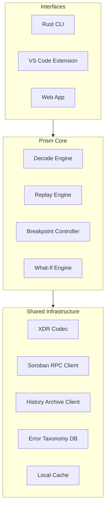

Prism is organized into a core library that all interfaces share, a shared infrastructure layer for network and data access, and multiple interface targets.

## Component Map

## Layers

- **Interfaces**: Consume the core logic to provide user-facing experiences.
- **Prism Core**: Implements the 3-tier diagnostic logic.
- **Shared Infrastructure**: Handles communication with the Stellar network and disk storage.
