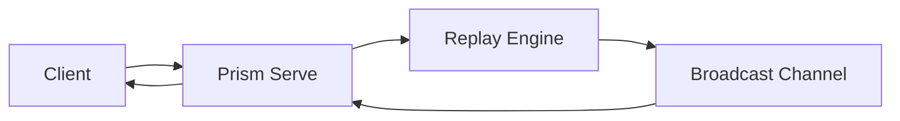

Prism provides a flexible WebSocket-based API for real-time transaction tracing. This guide covers how to integrate these capabilities into your own services.

## Overview

The streaming architecture allows you to receive incremental updates during long-running recomputations.



## Integration Steps

### 1. Start the Prism Server
Run the Prism server to expose the WebSocket endpoint:

```bash
prism serve --port 8080 --network mainnet
```

### 2. Connect via WebSocket
Connect your client to the server (e.g., using `tokio-tungstenite` in Rust or standard WebSockets in JavaScript).

```javascript
const ws = new WebSocket('ws://localhost:8080');

ws.onopen = () => {
  ws.send(JSON.stringify({
    tx_hash: "abc123..."
  }));
};
```

### 3. Handle Streamed Events
Handle the incoming JSON messages to update your UI or state.

<CodeGroup>
```javascript JavaScript
ws.onmessage = (event) => {
  const msg = JSON.parse(event.data);
  switch(msg.type) {
    case 'trace_started':
      console.log('Trace started...');
      break;
    case 'trace_node':
      updateTimeline(msg.node);
      break;
    case 'trace_completed':
      console.log('Done!');
      break;
  }
};
```
</CodeGroup>

## Performance Best Practices

- **Throttling**: Ensure your client can handle high-frequency updates (up to 200 messages per second).
- **Heartbeats**: Implement a ping/pong mechanism to detect connection drops.
- **Incremental UI**: Update your UI incrementally rather than re-rendering the entire execution tree on every message.
